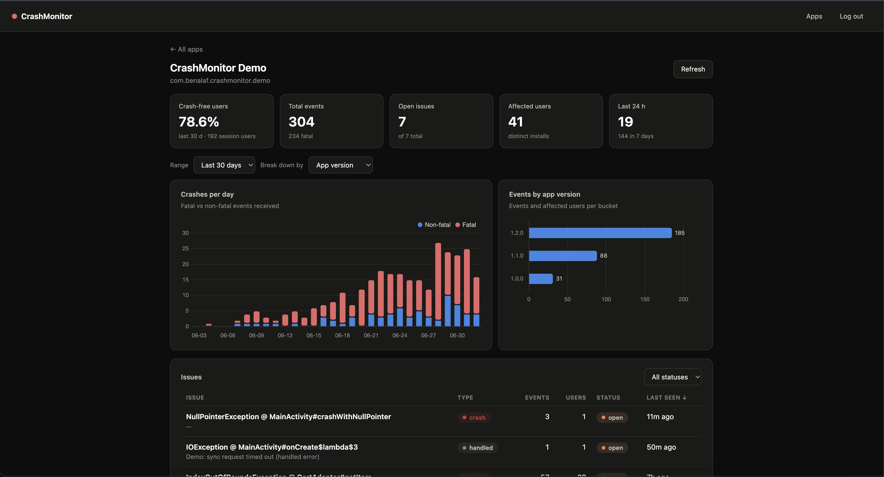
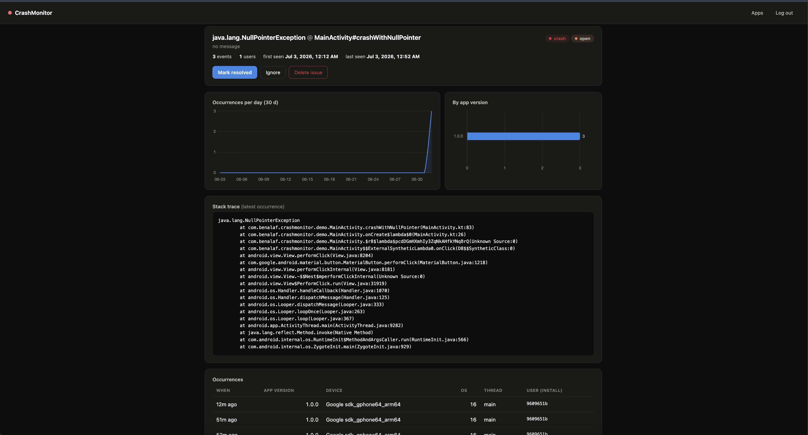
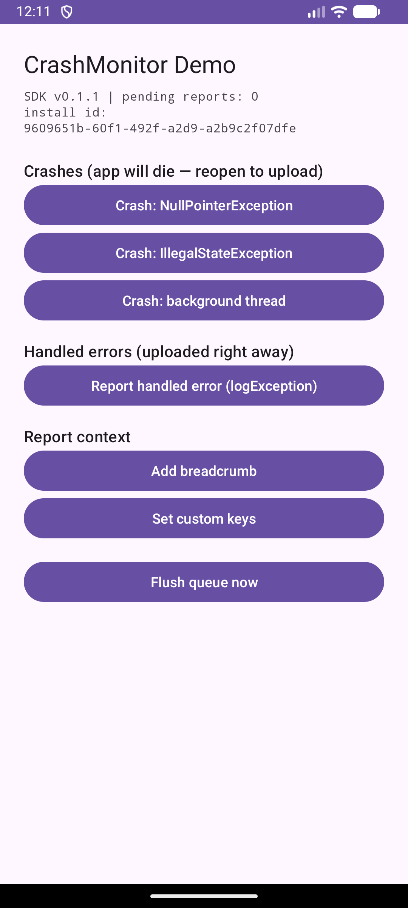

# CrashMonitor SDK

[](https://jitpack.io/#BenAlaf/crash-monitoring-sdk)
[](LICENSE)
[](https://crash-monitoring-sdk.vercel.app/)

**Crash & error monitoring for Android — a mini-Sentry.** An Android library catches uncaught exceptions and uploads them, a Flask backend groups identical crashes into issues via fingerprinting, and a web portal shows developers which bugs hit how many users on which app versions and devices.

Built as the final project for *26A-10221 Advanced Seminar in Mobile Development* (Afeka College of Engineering).

| | |
|---|---|
| 📚 **Documentation** | https://benalaf.github.io/crash-monitoring-sdk/ |
| 🖥 **Live portal** | https://crash-monitoring-sdk.vercel.app/portal/ |
| 🔌 **Live API + Swagger** | https://crash-monitoring-sdk.vercel.app/apidocs/ |
| 📦 **Library on JitPack** | `com.github.BenAlaf:crash-monitoring-sdk` |

---

## How it works

Two mechanisms carry the whole design:

**1. Capture the crash before the process dies.** A crashing app cannot be trusted to finish a network call — so the SDK never tries. Its `UncaughtExceptionHandler` writes the report to a private disk queue *synchronously* (write-to-temp + atomic rename), then hands the crash back to the OS untouched. On the **next launch**, the queue is uploaded in one batch. No network? Reports simply wait for a later launch — offline crashes are never lost.

**2. Fingerprint-based grouping: one bug = one issue.** The server reduces every report to a fingerprint — root-cause exception type + the top in-app stack frames (`class#method`, no line numbers, no message text) — so a bug that hits 1,000 users on three app versions is **one issue row** with counters, not a thousand rows. Distinct users are counted exactly, with O(1) writes per event.

```
┌─────────────────────────────┐
│ Android device              │
│ ┌─────────────────────────┐ │
│ │ Host app                │ │
│ │  └─ CrashMonitor SDK    │ │        HTTPS (X-API-Key)
│ │     ├─ CrashHandler ────┼─┼──┐  1. crash → write JSON to disk (sync)
│ │     ├─ Disk queue       │ │  │  2. next launch → upload batch
│ │     └─ Uploader ────────┼─┼──┼────────────┐
│ └─────────────────────────┘ │  │            ▼
└─────────────────────────────┘  │   ┌──────────────────────────────┐
                                 │   │ Flask API (Vercel)           │
┌─────────────────────────────┐  │   │  ├─ /api/v1/crashes  ingest  │
│ Developer's browser         │  │   │  │   └─ fingerprint → upsert │
│  Admin portal (/portal)     │──┼──▶│  ├─ /api/v1/sessions ingest  │
│  X-Admin-Key                │      │  ├─ /api/v1/apps     CRUD    │
└─────────────────────────────┘      │  ├─ /api/v1/…/issues CRUD    │
                                     │  ├─ /api/v1/…/stats  charts  │
                                     │  └─ /apidocs (Swagger)       │
                                     └──────────────┬───────────────┘
                                                    ▼
                                     ┌──────────────────────────────┐
                                     │ MongoDB Atlas                │
                                     │  apps · issues · events ·    │
                                     │  issue_users · sessions      │
                                     └──────────────────────────────┘
```

## Components

| Component | Where | Tech |
|---|---|---|
| **`crashmonitor/`** — the Android SDK | published to [JitPack](https://jitpack.io/#BenAlaf/crash-monitoring-sdk) | Kotlin, Retrofit 2 |
| **`app/`** — demo application | this repo (run in Android Studio / Gradle) | Kotlin |
| **`api/`** — REST backend | deployed on [Vercel](https://crash-monitoring-sdk.vercel.app/) | Flask, PyMongo, Flasgger |
| **`api/portal/`** — admin portal | served by the API at [/portal](https://crash-monitoring-sdk.vercel.app/portal/) | Vanilla JS + Chart.js |
| **`docs/`** — documentation site | [GitHub Pages](https://benalaf.github.io/crash-monitoring-sdk/) | Markdown / Jekyll |
| Database | MongoDB Atlas (M0) | 5 collections, aggregation pipelines |

## Features

- ✅ Catches **uncaught exceptions** on any thread; the OS crash flow stays untouched
- ✅ **Offline-safe**: reports persist on disk and upload when the network returns
- ✅ **Handled (non-fatal) errors** via `logException` — uploaded immediately
- ✅ **Breadcrumbs** and **custom keys** attached to every report
- ✅ **Fingerprint grouping** server-side — message/line-number changes don't split issues
- ✅ **Session pings** → **crash-free users %**, the headline health metric
- ✅ Per-issue and per-app **analytics**: crashes over time, breakdowns by app version / OS / device
- ✅ Portal with **issue lifecycle** (open → resolved / ignored), stack-trace viewer, occurrences
- ✅ Full **apps CRUD** with per-app API keys (SDK role) and an admin key (portal role)
- ✅ The SDK **never crashes the host app** — every public call is exception-safe

## Quick start — integrate the SDK

**1. Add JitPack** to `settings.gradle.kts`:

```kotlin
dependencyResolutionManagement {
    repositories {
        google()
        mavenCentral()
        maven { url = uri("https://jitpack.io") }
    }
}
```

**2. Add the dependency** (app module `build.gradle.kts`):

```kotlin
dependencies {
    implementation("com.github.BenAlaf:crash-monitoring-sdk:0.2.0")
}
```

**3. Initialize** in your `Application` class (register an app in the [portal](https://crash-monitoring-sdk.vercel.app/portal/) to get an API key):

```kotlin
class App : Application() {
    override fun onCreate() {
        super.onCreate()
        CrashMonitor.init(
            this,
            CrashMonitorConfig.Builder("your-api-key").build()
        )
    }
}
```

That's it — crashes now appear in the portal, grouped and counted. The SDK already declares the `INTERNET` permission; it merges into your manifest automatically.

Optional API:

```kotlin
CrashMonitor.logException(e, mapOf("endpoint" to "/sync"))  // handled error
CrashMonitor.addBreadcrumb("user tapped checkout")
CrashMonitor.setCustomKey("cart_size", "3")
CrashMonitor.flush()                    // force an upload attempt now
CrashMonitor.pendingReportCount()       // reports waiting on disk
```

Full guide: **[Getting started](https://benalaf.github.io/crash-monitoring-sdk/getting-started)** · **[Library reference](https://benalaf.github.io/crash-monitoring-sdk/library-reference)**

## Screenshots

| Portal — app dashboard | Portal — issue detail | Demo app |
|---|---|---|
|  |  |  |

## Try the demo app

The repo root is a ready Android Studio project:

```bash
git clone https://github.com/BenAlaf/crash-monitoring-sdk.git
# open in Android Studio, run the `app` configuration on an emulator/device
```

The demo has buttons for three distinct crash types, a handled error, breadcrumbs, custom keys and a flush — press a crash button, **reopen the app** (the upload happens on the next launch), and watch the issue appear in the portal.

## Repository layout

```
crash-monitoring-sdk/
├── crashmonitor/   # the Android SDK (Kotlin) — published to JitPack
├── app/            # demo app consuming the SDK
├── api/            # Flask backend + admin portal (deployed on Vercel)
│   ├── controllers/  services/  portal/  tests/  postman/
│   └── seed.py     # generate realistic demo data
├── docs/           # documentation site (GitHub Pages)
├── jitpack.yml     # JitPack build config (JDK 17)
└── IMPLEMENTATION_PLAN.md
```

## Documentation

The full documentation lives at **https://benalaf.github.io/crash-monitoring-sdk/**:

- [Getting started](https://benalaf.github.io/crash-monitoring-sdk/getting-started) — SDK integration in 5 minutes
- [Library reference](https://benalaf.github.io/crash-monitoring-sdk/library-reference) — the public Kotlin API
- [API reference](https://benalaf.github.io/crash-monitoring-sdk/api-reference) — every endpoint, with curl examples (live Swagger: [/apidocs](https://crash-monitoring-sdk.vercel.app/apidocs/))
- [Data model & fingerprinting](https://benalaf.github.io/crash-monitoring-sdk/data-model) — how grouping works and why
- [Portal guide](https://benalaf.github.io/crash-monitoring-sdk/portal-guide) — workflows and screenshots

A Postman collection covering the whole API is at [`api/postman/`](api/postman/crashmonitor.postman_collection.json).

## License

[MIT](LICENSE) © 2026 Ben Alaf
